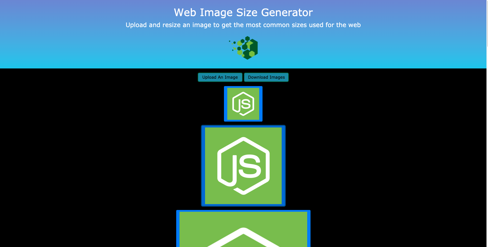
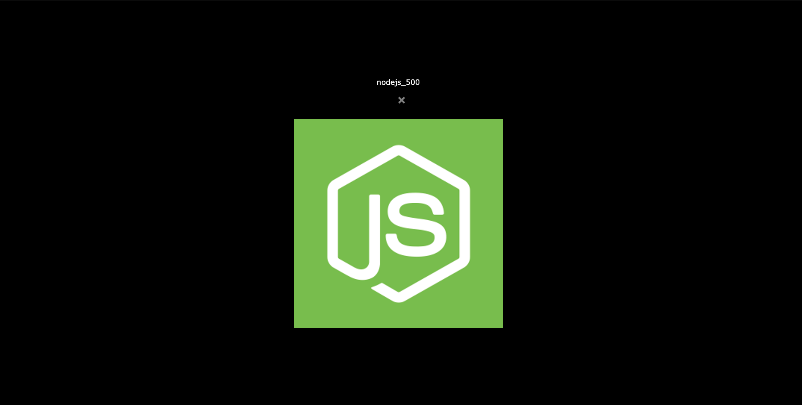

# [API Image Processing App](https://image-sizer.herokuapp.com/)

An app that can be used to upload an image an have it processed to multiple sizes that could be useful for web page images.  After the image is processed and uploaded, the newly generated images can be downloaded along with the original image as a zip file.

Tech stack includes Node.js, Express, TypeScript, Multer for file uploads, Sharp for image processing, Jasmine for Unit Testing, Pug and Boostrap as a templating engine and CSS framework, respectively, for Express generated pages.  This project relies on the Node.js file system module in conjunction with Multer, an express middleware used for handling multipart/form-data.

The home page will accept an image file upload, and process that image to various preset images sizes.  This is handled by Node.js Sharp image processing module found here: [https://sharp.pixelplumbing.com/](https://sharp.pixelplumbing.com/).

This repo can be cloned and custom image sizes or other processing affects offered with the Sharp module could be modified or added.  The file for working with image processing can be found in the `/src/utilities/sharp-resize.ts` file.

The Node.js scripts that exist in the package.json file include: `npm run lint` for using eslint for code linting; `npm run build` to use TypeScript to build the `dist` production folder, `npm run prettier` to format files; `npm run dev` for starting the development server with Nodemon; `npm start` to use node to run the `index.js` file found in the `/dist` production build folder; `npm run test` will do a production build, and runs the Jasmine Unit Tests.  The main focus of the tests is to verify API routes return HTTP status of 200, and verify generated test images.

This project is deployed to Heroku and can be found at: [https://image-sizer.herokuapp.com/](https://image-sizer.herokuapp.com/).

The first screenshot below shows some of the smaller image sizes generated after uploading an image.  The second screenshot shows the modal after clicking on the resized image.

